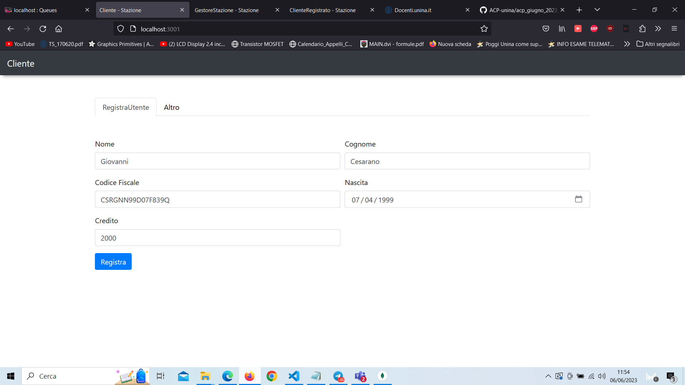
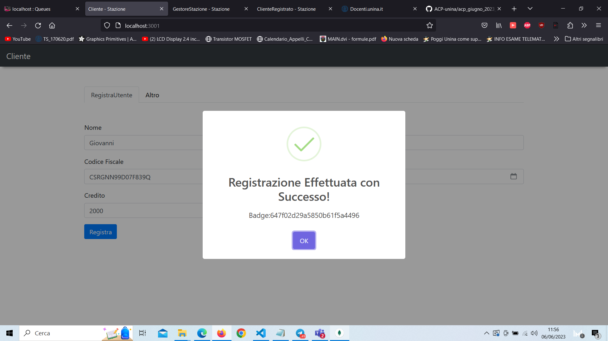
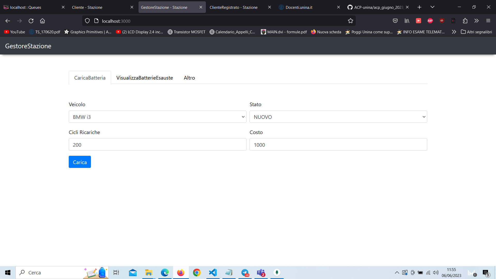
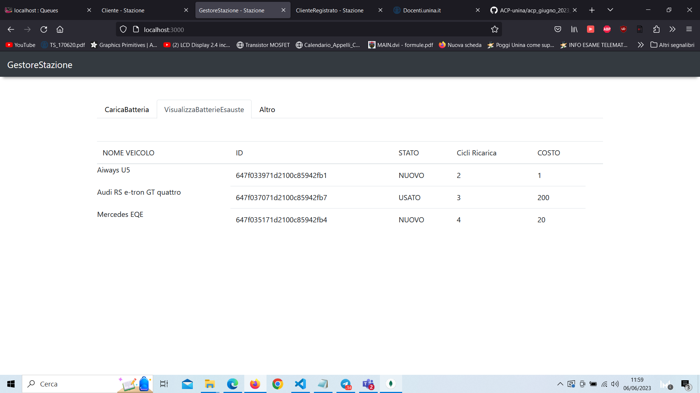
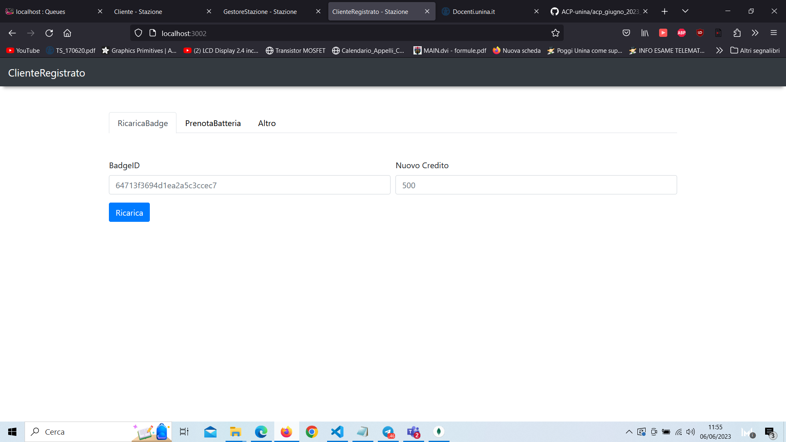
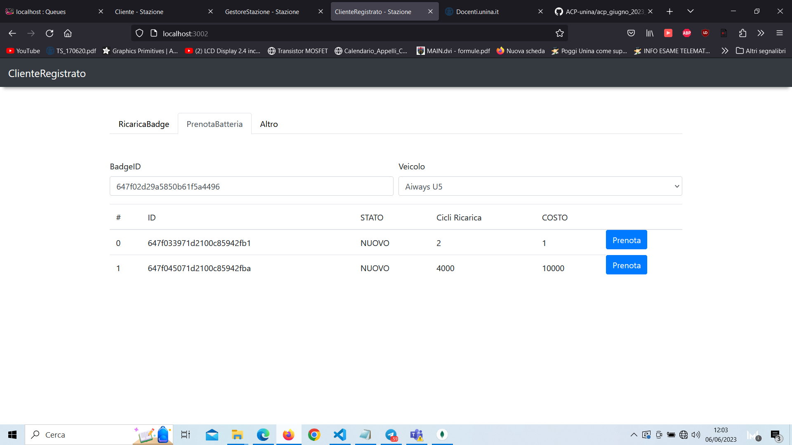
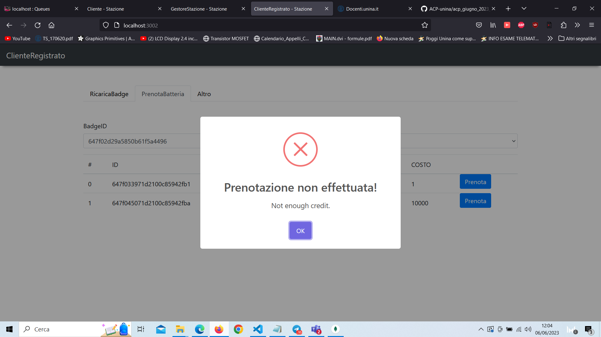
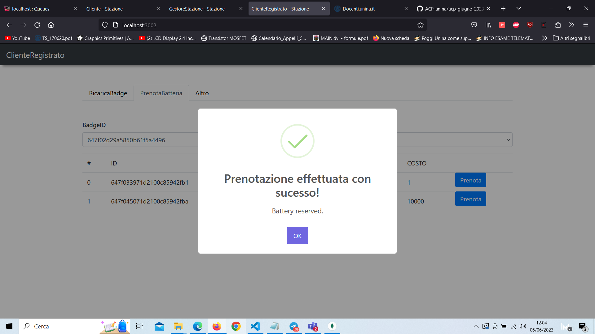

GIOVANNI CESARANO N46006030

PROGETTO ACP{nodejs/mongo + webapp}

Per ogni attore è stato messo a disposizione un servizio diverso in ascolto sui porti 3000,3001,3002.

Casi d'uso implementati:

Attore Cliente:\
-Registrazione

Attore ClienteRegistrato:\
-PrenotazioneBatteria.\
-RicaricaBadge.

Attore GestoreStazione:\
-CaricaBatteria.\
-VisualizzaBatterieEsauste.\
-VisualizzaUltimeSostituzioniCliente.

NB: nella cartella tesina è possibile visionare l'intera tesina di IS e una foto specifica del diagramma dei casi d'uso dell'intero sistema.

Ogni batteria prevede un numero X di cicli di ricarica.
Le batterie caricate dal gestore possono essere etichettate come NUOVE, USATE O VENDUTE. (In maniera molto simile all'esercitazione fatta a lezione del carrello).

Tutti gli endpoint/API sono stati implementati utilizzando il design RESTful, prevedendo quindi per uno stesso NOME 
l'implementazione di piu' httpVerbs li' dove necessario.
POST per la creazione.\
GET per il prelevamento di una risorsa.\
DELETE per eliminarla.\
PUT per l'update.

Non utilizzando un database relazionale la gestione è stata "semplificata" inserendo direttamente le batterie disponibili
nella collezione dei Veicoli, quindi per ogni Veicolo c'è un attributo "batterie" di tipo array.
Ogni batteria oltre allo stato prevedono un costo, il numero di cicli di ricarica e nel caso in cui sia stato venduto memorizza l'id acquirente.

----------------------------------
** WORKFLOW  **

1) Il cliente ad uno dei sistemi della stazione puo' registrarsi inserendo le proprie informazioni e caricando tramite carta il proprio credito. (questo passaggio è solo simulato, il credito verra' quindi semplicemente fornito in input ).
2) Il cliente puo' quindi richiedere la prenotazione di una batteria per il proprio veicolo.

3) Un operatore puo' quindi sostituire la batteria su richiesta del cliente applicando una penale se questo avviene dopo un prolungato periodo di tempo (le batterie sostituite ma con ancora cicli di ricarica disponibili vengono re-inserite etichettandole come "USATE");

4) Il gestore nel frattempo puo' inserire nello stock altre batterie, visualizzare le batterie esauste e visualizzare le prenotazioni/sostituzioni dei clienti

----------------------------------
** FOTO WEB-APP **

Nella cartella fotowebapp c'è anche un video dimostrazione della webapp chiamato video.mkv

